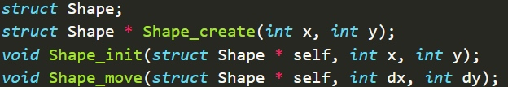
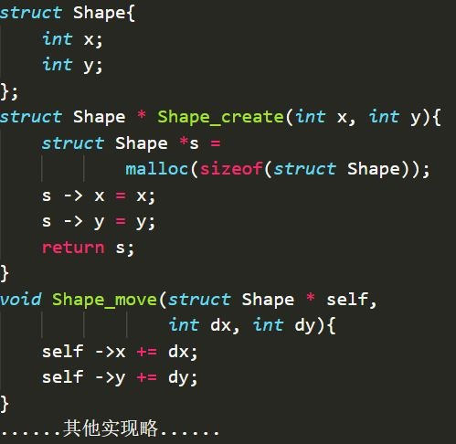
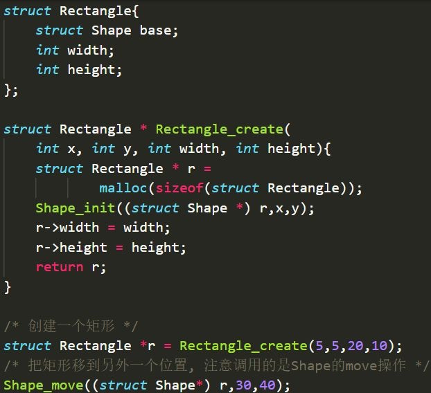
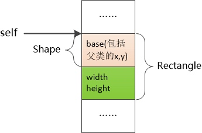
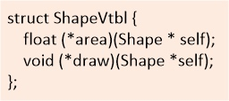
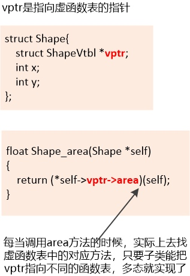
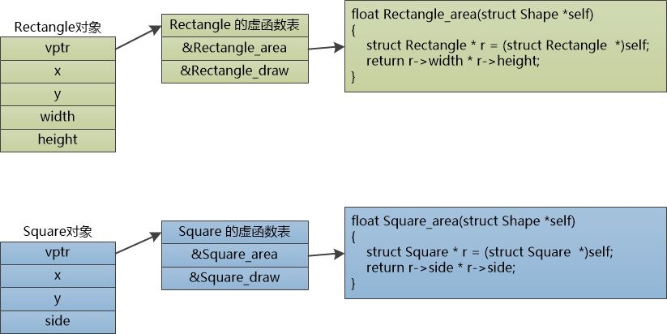

# OOP In C

## 封装 
    1. 定义结构体，可看做为Class
    2. 外界通过 函数 对 结构体 进行操作，如初始化，修改属性

## 继承
    1. 通过组合方式
    2. 在子结构体中，引入“父结构体”。
    

内存布局大概如下：
    

## 多态：
    1. 通过 函数指针
    
定义 虚函数指针表

如上图，主要是重载虚函数表，更换函数指针。